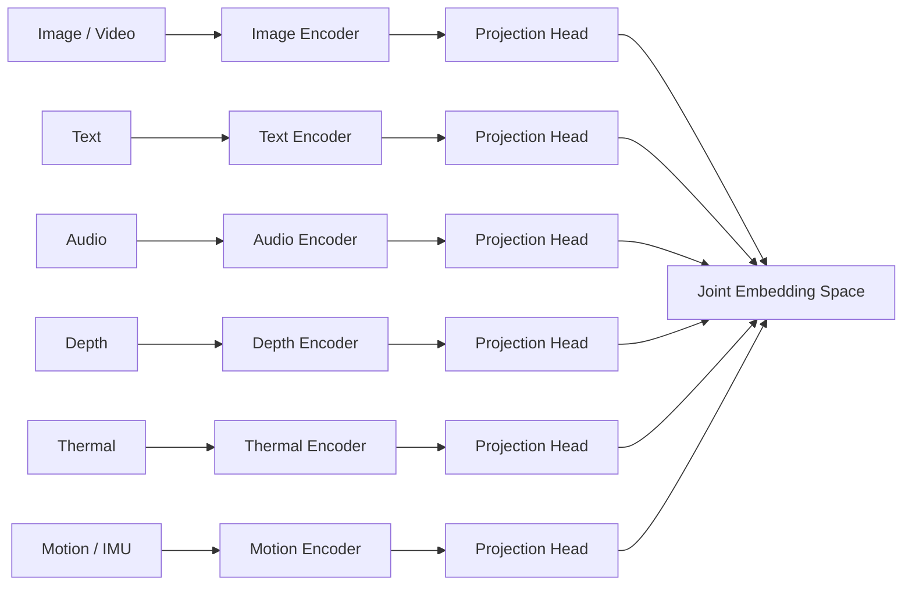

# MASTER RUBRIC REPORT

## Project Formulation

This project implements course-scale ImageBind-style learning across five datasets and modalities: audio, image-text, thermal, depth, and motion/IMU. Each notebook trains a small model from scratch for at least one epoch or benchmarks an encoder when paired image-anchor data is unavailable.

## ImageBind Method Explanation

ImageBind learns one shared embedding space for many modalities. It does not require a dataset where all modalities appear together at once. Instead, image or video is used as a natural anchor. For each paired sample `(I, M)`, the model encodes image `I` into `q_i` and modality `M` into `k_i`. Symmetric InfoNCE pulls positive pairs together and pushes in-batch negatives apart.

When audio, text, depth, thermal, and motion are each aligned to image space, alignment between modalities that were not directly paired can emerge. This project is a mini/scratch Kaggle implementation and does not aim to reproduce full pretrained ImageBind performance.



ASCII alternative:

```text
Image/Text/Audio/Depth/Thermal/Motion -> Encoders -> Projection heads -> Joint embedding space
```

## Notebook Summary

| Notebook | Dataset | Modality | Epochs | Train from scratch | Metrics | Ablation | Limitation |
|---|---|---|---:|---|---|---|---|
| 01 | ESC-50 | Audio-Text | notebook config/report | Yes | Top-1, Top-5, A2T/T2A Recall@K | Added temperature/prompt status | Fold 5 only |
| 02 | Flickr8k | Image-Text | 1 baseline | Yes | I2T/T2I Recall@K | Temperature | One epoch |
| 03 | LLVIP | Visible-Thermal | notebook config/report | Yes | I2Thermal/Thermal2I Recall@K, optional binary | Temperature | Retrieval pairs and crop classification subsets differ |
| 04 | NYU Depth V2 | RGB-Depth | notebook config/report | Yes | I2D/D2I Recall@K, optional Top-1/Top-5 | Temperature plus second ablation status | Mini CNN, capped subset |
| 05 | UCI HAR | Motion/IMU | notebook config/report | Yes | Accuracy, macro-F1, confusion matrix | LR/hidden size | No image/video anchor, not full ImageBind |

## Missing Before vs Fixed After

| Area | Before | Fixed after addon |
|---|---|---|
| Unified metadata | Inconsistent | `final_eval_summary.json` per notebook |
| Ablation files | Missing or differently named | `ablation_summary.json/png` standardized |
| Reports | Mixed names/styles | `<notebook>_rubric_report.txt` added |
| Master report | Missing | `MASTER_RUBRIC_REPORT.md` generated |
| Submission checklist | Missing | `README_SUBMISSION_CHECKLIST.md` generated |

## Impact

The project demonstrates how shared embeddings can connect heterogeneous sensory signals: environmental audio, captions/images, thermal vision, RGB-depth geometry, and smartphone IMU motion. These modalities support retrieval, perception, robotics, AR/VR, assistive sensing, healthcare monitoring, and multimodal search.

## Limitations

All models are lightweight and trained from scratch under Kaggle limits. They do not use pretrained ImageBind, OpenCLIP, or web-scale training. UCI HAR has no paired image/video anchor, so it is only a motion encoder benchmark. Some evaluations are subset-based for runtime.

## Future Work

Train longer, evaluate all official folds where applicable, add stronger augmentations, compare projection heads, align IMU with video/text using paired data, and integrate all modality encoders into a single shared evaluation dashboard.
